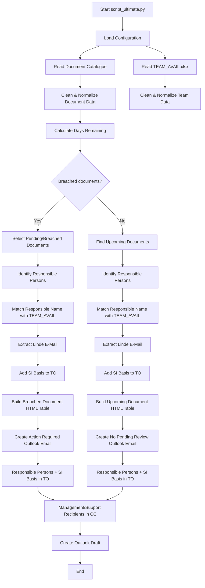

# Document Review Automation

## Overview

This automation script checks the SAP Basis document catalogue for document reviews that are due or approaching their review date.

It reads the document catalogue and team availability data, identifies the relevant documents, determines the responsible person(s), retrieves their email addresses, and creates an Outlook email with the appropriate recipients and review details.

> **Important:** Always use **`script_ultimate.py`** to execute the automation.
> Do not use older or intermediate versions of the script.

---

## Process Flow



---

## Input Files

### 1. Document Catalogue

The script reads the configured document catalogue:

```text
Document_Catalogue_2026_V1.0.xlsx
```

The relevant sheet is:

```text
Master Document
```

The script uses the following document information:

* Document Name
* Location of the Document with Link
* Responsible
* Review Cycle
* Remarks
* Status
* Review Date
* Next Planned Review Date

---

### 2. Team Availability File

The script reads:

```text
TEAM_AVAIL.xlsx
```

This file provides the mapping between responsible persons and their Linde email addresses.

Relevant columns include:

* `Name`
* `Linde_E-Mail`
* `Kanban`

The Responsible value from the document catalogue is matched against the team member information to determine the recipient email address.

---

# Review Processing

## 1. Breached Document Check

The script calculates the number of days between the review date and today's date.

Documents are considered for breach processing when their status is:

* Blank
* `PENDING`

The breach window is configured as:

```python
BREACH_WINDOW_DAYS = 4
```

Therefore, documents that are due or within the configured breach window are included in the Action Required email.

---

## 2. Upcoming Documents

If there are no breached documents, the script searches for upcoming document reviews.

The upcoming review window is:

```text
Today → Today + 31 days
```

The upcoming documents are sorted by their **Next Planned Review Date**.

Only the next 10 documents are included.

---

# Email Logic

## Scenario 1 – Breached Documents Found

When breached documents are found:

```text
Breached Documents
        ↓
Identify Responsible Persons
        ↓
Find Email Addresses
        ↓
Add SI Basis
        ↓
Create Action Required Email
```

The **To** field contains:

```text
Responsible Person Email(s)
+
si_basis@linde.com
```

The configured management/support recipients are added to **CC**.

The email subject is:

```text
Document Review Alert - Action Required
```

---

## Scenario 2 – No Breached Documents

When no breached documents are found:

```text
No Breached Documents
        ↓
Find Upcoming Documents
        ↓
Identify Responsible Persons
        ↓
Find Email Addresses
        ↓
Add SI Basis
        ↓
Create Upcoming Review Email
```

The **To** field contains:

```text
Responsible Person Email(s)
+
si_basis@linde.com
```

The email contains the upcoming document review table.

The email subject is:

```text
Document Review Alert - No Pending Reviews
```

---

# SI Basis Recipient

`si_basis@linde.com` must **always receive the email**, regardless of the email scenario.

Therefore:

```text
Breached Email
    → SI Basis receives it

No-Breach / Upcoming Email
    → SI Basis receives it
```

The responsible person's email addresses are added in addition to SI Basis.

Duplicate email addresses are removed before creating the Outlook draft.

---

# Email Content

The generated email contains an HTML table with:

| Column                   | Description                         |
| ------------------------ | ----------------------------------- |
| Document Name            | Name of the document                |
| Location                 | Link to the document                |
| Responsible              | Person responsible for the document |
| Review Cycle             | Review frequency                    |
| Remarks                  | Document remarks                    |
| Status                   | Current review status               |
| Review Alert             | Review urgency                      |
| Review Date              | Current/previous review date        |
| Next Planned Review Date | Next scheduled review               |

---

# Review Alert Colour Coding

For upcoming documents:

| Days Remaining | Colour    |
| -------------: | --------- |
|      0–14 days | 🔴 Red    |
|     15–30 days | 🟡 Yellow |
|       31+ days | 🟢 Green  |

For breach processing:

| Condition                | Alert                  |
| ------------------------ | ---------------------- |
| Review date passed       | `BREACHED BY X DAY(S)` |
| Review due today         | `BREACHING TODAY`      |
| Due tomorrow             | `BREACHING IN 1 DAY`   |
| Due within breach window | `BREACHING IN X DAYS`  |

---

# Outlook Processing

The script uses Outlook through:

```python
win32com.client
```

The email is created as an Outlook draft using:

```python
outlook.CreateItem(0)
```

The recipient lists are assigned to:

```python
mail.To
mail.CC
```

The HTML content is assigned to:

```python
mail.HTMLBody
```

The draft is displayed and saved in Outlook.

---

# Important Execution Rule

## Always use `script_ultimate.py`

**`script_ultimate.py` is the current and approved version of the automation.**

Always execute:

```text
script_ultimate.py
```

Do **not** execute older scripts, backup versions, test versions, or intermediate versions unless specifically required for troubleshooting.

Before making future changes:

1. Open `script_ultimate.py`.
2. Make the required modification there.
3. Test the updated script.
4. Keep `script_ultimate.py` as the latest working version.

---

# High-Level Flow

```text
                 ┌──────────────────────┐
                 │  script_ultimate.py  │
                 └──────────┬───────────┘
                            │
                 ┌──────────▼───────────┐
                 │ Read Input Files      │
                 │ Document Catalogue    │
                 │ TEAM_AVAIL.xlsx       │
                 └──────────┬───────────┘
                            │
                 ┌──────────▼───────────┐
                 │ Calculate Review      │
                 │ Dates & Status        │
                 └──────────┬───────────┘
                            │
                   ┌────────▼────────┐
                   │ Breached Docs?  │
                   └───────┬─────────┘
                     Yes   │   No
                      │    │
             ┌────────▼┐   └───────────────┐
             │ Breached│                   │
             │ Documents                   │
             └────┬────┘            ┌──────▼──────┐
                  │                 │ Upcoming     │
                  │                 │ Documents    │
                  │                 └──────┬───────┘
                  │                        │
                  └──────────┬─────────────┘
                             │
                  ┌──────────▼───────────┐
                  │ Identify Responsible │
                  │ Persons               │
                  └──────────┬───────────┘
                             │
                  ┌──────────▼───────────┐
                  │ Get Linde E-Mail      │
                  │ from TEAM_AVAIL       │
                  └──────────┬───────────┘
                             │
                  ┌──────────▼───────────┐
                  │ Add SI Basis         │
                  │ to TO                 │
                  └──────────┬───────────┘
                             │
                  ┌──────────▼───────────┐
                  │ Generate Outlook      │
                  │ Email                 │
                  └──────────┬───────────┘
                             │
                  ┌──────────▼───────────┐
                  │ Display & Save Draft  │
                  └───────────────────────┘
```

---

## Maintenance

When modifying the automation, ensure that:

* `script_ultimate.py` remains the primary executable script.
* Changes to recipient logic are tested with both breached and upcoming documents.
* `si_basis@linde.com` remains a recipient for **all email scenarios**.
* Responsible-person email mapping continues to use `TEAM_AVAIL.xlsx`.
* The HTML table and recipient logic remain consistent with the document data.
* Duplicate recipient email addresses are removed before creating the Outlook draft.

---

## Summary

The automation performs the following sequence:

**Read → Clean → Calculate → Identify Reviews → Identify Responsible Persons → Resolve Emails → Add SI Basis → Build HTML → Create Outlook Email → Save Draft**

> **Always use `script_ultimate.py` as the latest working version of the automation.**
